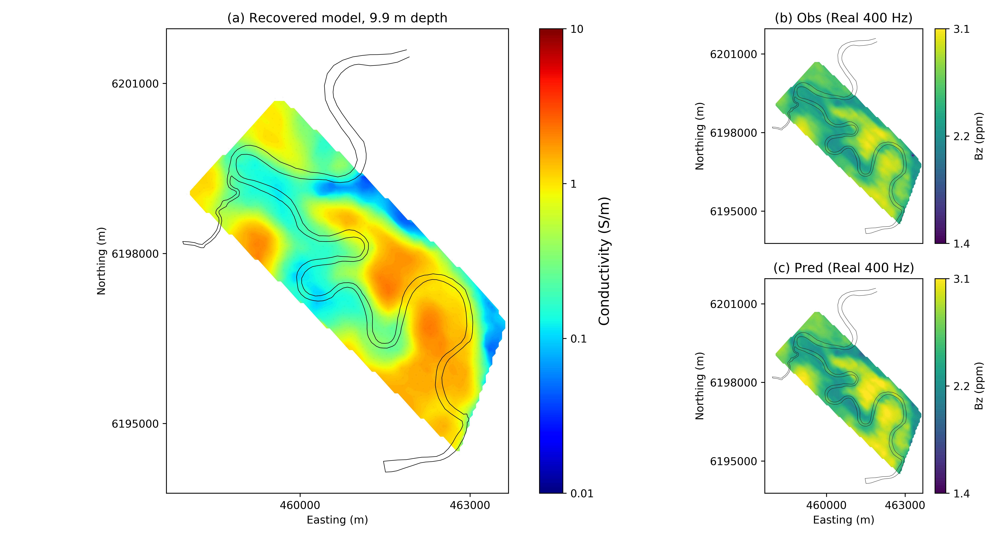

# A framework for simulation and inversion in electromagnetics 

_ Lindsey J. Heagy, Rowan Cockett, Seogi Kang, Gudni K. Rosenkjaer and Douglas W. Oldenburg_

(https://doi.org/10.1016/j.cageo.2017.06.018)



## Summary

Simulations and inversions of electromagnetic geophysical data are paramount for discerning meaningful information about the subsurface from these data. Depending on the nature of the source electromagnetic experiments may be classified as time-domain or frequency-domain. Multiple heterogeneous and sometimes anisotropic physical properties, including electrical conductivity and magnetic permeability, may need be considered in a simulation. Depending on what one wants to accomplish in an inversion, the parameters which one inverts for may be a voxel-based description of the earth or some parametric representation that must be mapped onto a simulation mesh. Each of these permutations of the electromagnetic problem has implications in a numerical implementation of the forward simulation as well as in the computation of the sensitivities, which are required when considering gradient-based inversions. This paper proposes a framework for organizing and implementing
electromagnetic simulations and gradient-based inversions in a modular, extensible fashion. We take an object-oriented approach for defining and organizing each of the necessary elements in an electromagnetic simulation,
including: the physical properties, sources, formulation of the discrete problem to be solved, the resulting fields and fluxes, and receivers used to sample to the electromagnetic responses.  A corresponding implementation is provided as part of the open source simulation and parameter estimation project \SimPEG (http://simpeg.xyz). The application of the framework is demonstrated through two synthetic examples and one field example. The first
example shows the application of the common framework for 1D time domain and frequency domain inversions. The second is a field example that demonstrates a 1D inversion of electromagnetic data collected over the Bookpurnong Irrigation District in Australia. The final example shows how the modular implementation is used to compute the sensitivity for a parametric model where a transmitter is positioned inside a steel cased well.

## Citation

Heagy, L. J., Cockett, R., Kang, S., Rosenkjaer, G. K., & Oldenburg, D. W. (2017). A framework for simulation and inversion in electromagnetics. Computers & Geosciences, 107, 1–19. https://doi.org/10.1016/j.cageo.2017.06.018

```
@article{heagy_inversion_2017,
title = {A framework for simulation and inversion in electromagnetics},
author = {Lindsey J. Heagy and Rowan Cockett and Seogi Kang and Gudni K. Rosenkjaer and Douglas W. Oldenburg},
journal = {Computers & Geosciences},
volume = {107},
pages = {1-19},
year = {2017},
issn = {0098-3004},
doi = {https://doi.org/10.1016/j.cageo.2017.06.018},
url = {https://www.sciencedirect.com/science/article/pii/S0098300416303946},
}

```
